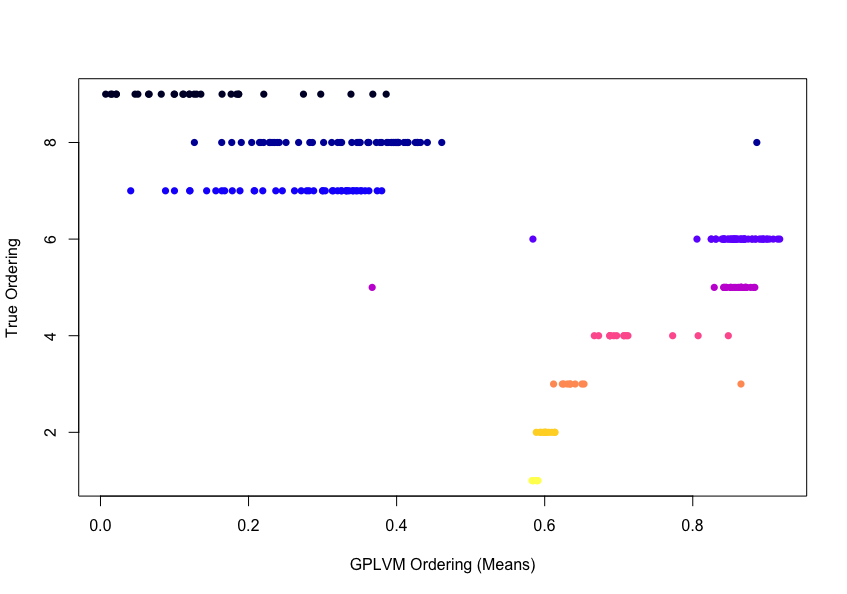
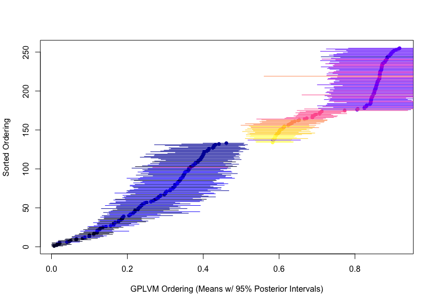

Inferring Cellular Developmental Time
========================================================
autosize: true  
transition-speed: slow

"From Multivariate to Longitudinal Data"  April 11, 2017

Caleb Lareau  bit.ly/LareauBST245</a> 

Overview
========================================================
 
- Motivation
- Single cell RNA-Seq
- Model Dataset
  - EDA
- Methods of estimating pseudotime (developmental time)
  - PCA (Probablistic)
  - Gaussian Process Latent Variable Modeling
  - Diffusion Components
- Evaluation of methods in model data setting

Trajectories...
========================================================

========================================================

 ~3 million cells 
 ~ 20 billion cells 
 ~ 50 trillion cells  

- What are the key points in development for disease?

========================================================

 

Questions from a developmental biology perspective
========================================================
 
- What happens in a cell such that it becomes a brain, toe, or a heart?
  - When do these decisions get made? "Who" makes them?  
- How do the developmental trajectories of disease (leukemia / schizophrenia) differ from healthy individuals?   
- Can we identify important transition points and the genetic signature underlying them?

Waddington Landscape
========================================================
 

 

Some cancers regain stemness programs
========================================================

 
Stergachis $et al.$, Cell 2013

"Stem cell-like" covariate is important in AML
========================================================
  

 
Corces $et al.$ Nature Genetics, 2016

========================================================

 
Proserpio and Mahata, Immunology 2015

Statement of problem
========================================================
 
<b>Given a matrix of $m$ genes (features) by $n$ samples, compute a vector $n$ x $1$ that:</b>

========================================================

Mannifold learning
========================================================
 
- Next several images taken from slides via Guy Wolf (Yale)

- These slides can be found <a href="http://users.math.yale.edu/users/gw289/CpSc-445-545/Slides/CPSC445%20-%20Topic%2010%20-%20Diffusion%20Maps.pdf">here</a> 

========================================================

========================================================

Impetus 
========================================================
 
- Lots of single cell data on the horizon...   

  
Assumes ~2% non-missing rate

- What do? 

========================================================

Linearly increasing
========================================================

Dropoff
========================================================

Linear Decreasing
========================================================

Varying, no clear effect
========================================================

V-shaped
========================================================

Transition on/off
========================================================

Sigmoidal with dropout
========================================================

Overall picture
========================================================
 
$\forall$ gene $g$, fit OLS Regression with known timepoint $t$ per cell--   

$$log_2(g +1) = \beta_0 + \beta_1 t $$

========================================================
  

========================================================
  

 

========================================================
  

========================================================
  

 
Slides from Neil Lawrence

GPLVM
========================================================
  

GPLVM
========================================================
  

