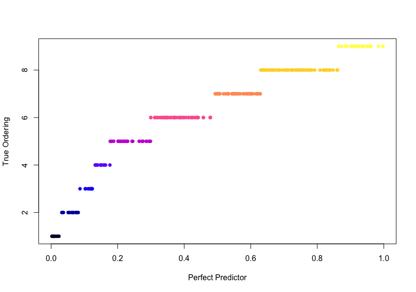
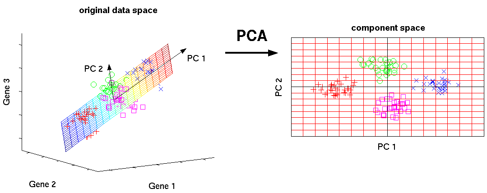

<style>
.footer {
    color: black;
    background: #E8E8E8;
    position: fixed;
    top: 90%;
    text-align:center;
    width:100%;
}
.midcenter {
    position: fixed;
    top: 50%;
    left: 50%;
}
.small-code pre code {
  font-size: 1em;
}

.reveal h3 {
  word-wrap: normal;
  -moz-hyphens: none;
}
.reveal h1 {
  word-wrap: normal;
  -moz-hyphens: none;
}

.reveal h1, .reveal h2, .reveal h3 {
  word-wrap: normal;
  -moz-hyphens: none;
}

</style>

Inference of Cellular Developmental Time
========================================================
transition-speed: default
transition: fade
autosize: false


"From Multivariate to Longitudinal Data"<br><br>April 11, 2017

<div class="footer" style="margin-top:-50px;background-color:transparent;"><SPAN STYLE="font-size:80%;font-weight:bold;">Caleb Lareau <br>bit.ly/LareauBST245</a> </SPAN></div>

Overview
========================================================
- Motivation
  - Single cell RNA-Seq
- Model Dataset
  - EDA
- Methods of estimating developmental time
  - PCA 
  - Probablistic PCA; Bayesian PCA
  - Gaussian Process Latent Variable Modeling 

Trajectories...
========================================================

========================================================
<DIV ALIGN=CENTER>
 ~3 million cells<br>
 ~ 20 billion cells<br>
 ~ 50 trillion cells<br><br>
</DIV>
- What are the key points in development for disease?


========================================================
<DIV ALIGN=CENTER>
<br>

</DIV>

Questions from developmental biology
========================================================
<br>
- What happens in a cell such that it becomes a brain, toe, or a heart?
  - When do these decisions get made? "Who" makes them?<br><br>
- How do the developmental trajectories of disease (leukemia / schizophrenia) differ from healthy individuals? <br><br>
- Can we identify important transition points and the genetic signature underlying them?


Waddington Landscape
========================================================
<br>
<DIV ALIGN=CENTER>

</DIV><br>

Some cancers regain stemness programs
========================================================
<DIV ALIGN=CENTER>

</DIV><br>
Stergachis $et$   $al.$, Cell 2013


Stem cell-likeness in AML
========================================================
<DIV ALIGN=CENTER>


</DIV><br>
Corces $et$   $al.$ Nature Genetics, 2016

How do we characterize single cells?
========================================================


========================================================
<DIV ALIGN=CENTER>

</DIV><br>
Proserpio and Mahata, Immunology 2015


========================================================
<br>
<DIV ALIGN=CENTER>

</DIV><br>

========================================================
<br>
<DIV ALIGN=CENTER>

</DIV><br>

========================================================
<br>
<DIV ALIGN=CENTER>

</DIV><br>

========================================================
<DIV ALIGN=CENTER>

</DIV><br>

========================================================

<DIV ALIGN=CENTER>

</DIV><br>


========================================================
<DIV ALIGN=CENTER>

</DIV>

========================================================
<br>
<DIV ALIGN=CENTER>

</DIV>

========================================================
<br>
<DIV ALIGN=CENTER>

</DIV>


========================================================
<DIV ALIGN=CENTER>

</DIV>


EDA
========================================================
class: small-code
<br>

```r
> dim(deng)

[1] 17585   255

> sum(deng == 0) / prod(dim(deng))

[1] 0.5019552

> head(sample(colnames(deng)))

[1] "earlyblast" "16cell" "4cell" "midblast" "lateblast" "16cell"   

> head(sample(rownames(deng)))

[1] "Gm7073"  "Mir697"  "Uqcrc2"  "Ap2m1"   "Slc10a3" "Ccr1"   
```

========================================================
<DIV ALIGN=CENTER>

</DIV>

Linearly increasing
========================================================
<DIV ALIGN=CENTER>

</DIV>

Dropoff
========================================================
<DIV ALIGN=CENTER>

</DIV>

Linear Decreasing
========================================================
<DIV ALIGN=CENTER>

</DIV>

Varying, no clear effect
========================================================
<DIV ALIGN=CENTER>

</DIV>


V-shaped
========================================================
<DIV ALIGN=CENTER>

</DIV>


Transition on/off
========================================================
<DIV ALIGN=CENTER>

</DIV>

Sigmoidal with dropout
========================================================
<DIV ALIGN=CENTER>

</DIV>

Overall picture
========================================================
<br>
$\forall$ gene $g$, fit OLS Regression with known timepoint $t$ per cell--   

$$\log_2(g +1) \sim \beta_0 + \beta_1 t $$

<DIV ALIGN=CENTER>

</DIV>

Permuted
========================================================
<br>
$\forall$ gene $g$, fit regression with permuted timepoint $t^*$ per cell

$$\log_2(g +1) \sim \beta_0 + \beta_1 t^* $$

<DIV ALIGN=CENTER>

</DIV>

Permuted
========================================================
<br>
$\forall$ gene $g$, fit regression with permuted **factor** timepoint $t^{**}$   

$$\log_2(g +1) \sim \beta_0 + \beta_1 t^{**} $$

<DIV ALIGN=CENTER>

</DIV>


Statement of problem
========================================================
<br>
Given a matrix $\mathbf{Y}$ of $D$ genes (features) by $n$ samples, determine a latent vector $\mathbf{P}$ with dimension $1$ x $n$ that reflects the developmental trajectory of the $n$ cells from the variance in $D$ genes.<br>
- $D$ can be thought of has a higher dimension space, and we want to infer $d$ ($d$ < $D$) latent variables in the gene data.
  - One of the $d$ latent variables ideally reflects developmental ordering. 


Perfect latent variable
========================================================
class: small-code
<DIV ALIGN=CENTER>

</DIV>

```r
> cor(runif(length(time)) %>% sort(), as.numeric(time) %>% sort())^2

[1] 0.8799669
```

PCA
========================================================
<br>
<DIV ALIGN=CENTER>

</DIV>

Computing PCA
========================================================

$\mathbf{Y}$ is a $D$ x $n$ matrix. Compute the covariance matrix--

$$ \mathbf{\Sigma} = E(\mathbf{YY^{T}}) - \mathbf{\mu \mu^T}$$
where $\mathbf{\mu} = E(\mathbf{Y})$ <br>

Then compute the spectral decomposition of $\mathbf{\Sigma}$

$$\mathbf{\Sigma} a_j = \lambda_j a_j$$
for $j \in (1, ..., D)$
<br><br>
Then $a_j$ represent the eigenvectors of the data matrix $\mathbf{Y}$. <br> Note the ordering of $j$ is meaningful-- 
$$ \lambda_1 \geq \lambda_2 \geq ... \geq \lambda_D \geq 0$$

Computing PCA
========================================================
class: small-code

```r
> irlba::prcomp_irlba()

> prcomp()

> princomp()
```

PCA
========================================================
class: small-code
<DIV ALIGN=CENTER>

</DIV>

```r
> cor(pca$rotation[,1], as.numeric(time))^2

[1] 0.5933009
```


Correlation with all PCs
========================================================
<DIV ALIGN=CENTER>

</DIV>


Pause...
========================================================
<br><br> <br> 
PCA by itself isn't satisfactory... <br> <br> <br><br> Ideas for improvements?

Improving on PCA 
========================================================
<br><br>
1) Quantifiying uncertainty <br> <br> 2)  Non-linear latent variable inference

Uncertainty
========================================================
<DIV ALIGN=CENTER>

</DIV><br> 
From Buenrostro $et$   $al.$ bioRxiv 2017


Mannifold / Non-linear dimension learning
========================================================
<br>
- Next several images taken from slides via Guy Wolf (Yale)

- These slides can be found <a href="http://users.math.yale.edu/users/gw289/CpSc-445-545/Slides/CPSC445%20-%20Topic%2010%20-%20Diffusion%20Maps.pdf">here</a> 

========================================================
<DIV ALIGN=CENTER>

</DIV>

========================================================
<DIV ALIGN=CENTER>

</DIV>


========================================================
<br>
<DIV ALIGN=CENTER>

</DIV>


========================================================
<br>
<DIV ALIGN=CENTER>

</DIV>

Tackling 1 and building to 2
========================================================
<br>
<DIV ALIGN=CENTER>

</DIV><br>

========================================================
<br><br><br>
<DIV ALIGN=CENTER>

</DIV><br>


========================================================
<DIV ALIGN=CENTER>

</DIV><br>
Slide from Neil Lawrence

Factor Analysis
========================================================
$\mathbf{Y}$ is a $D$ x $n$ matrix. $\mathbf{x}$ is a $d$ x $n$ matrix ($d < D$). Want to relate $\mathbf{x}$ and $\mathbf{Y}$ and assume that the relationship is linear--

$$ \mathbf{Y = Wx} + \epsilon$$<br>
where $W$ is a $D$ x $d$ matrix. <br><br>

By convention (after locating the matrix),<br><br> $$\mathbf{x} \sim \mathcal{N} (0, \mathbf{I})$$<br>
where $\mathbf{I}$ is the identity matrix of dimension $d$ x $d$. 

Factor Analysis II
========================================================
Specify the error, $$\epsilon \sim \mathcal{N} (0, \mathbf{\Psi})$$<br>
where we assume $\mathbf{\Psi}$ to be a diagonal matrix  $D$ x $D$.
<br><br>
- Assuming the diagonal structure of $\mathbf{\Psi}$ means that all observertional correlations is due to the latent variables.
- In other words, $Y_i$ for $i \in (1, ..., n)$ are conditionally independent given $\mathbf{x}$

Factor Analysis III
========================================================
Then $Y_i$ for $i \in (1, ..., n)$,<br><br> $$Y_i |x_i \sim  \mathcal{N} (0, \mathbf{\Psi})$$
<br>
Then we can integrate out the latent variables--

$$p( Y_i |\mathbf{W}, \mathbf{\Psi})= \int p( Y_i | x_i , \mathbf{W, \Psi}) p(x_i) dx_i  $$

Under this specification, we can write the MVN distribution for our observations-- <br><br>$$\mathbf{Y} \sim  \mathcal{N} (0, \mathbf{C}), \mathbf{C} = \mathbf{WW^T }+ \mathbf{\Psi}  $$

Computing PCA via Factor Analysis
========================================================
<br>
Young-Whittle Factor Analysis (1950s)
<br><br>
$\psi_i$ element of the diagonal of $\Psi$; add constraint $\psi_i = \sigma^2$<br><br>
Assume $\sigma^2$ known, MLE yields same $W$ as PCA <br><br>
$$  \mathcal{L} = \tfrac{-N}{2}\{ D\log(2\pi) + \log|\mathbf{C}| + \textrm{tr}(\mathbf{C}^{-1}\mathbf{\Sigma})  \}   $$<br>
$$\mathbf{C} = \mathbf{WW^T }+ \mathbf{\Psi} $$ <br>
$$  \mathbf{x} = \mathbf{C^{-1}W^{T}Y}$$

Probablistic PCA (Tipping and Bishop)
========================================================
- Assuming $\sigma^2$ may not be reasonable; want to estimate it from the data (keep in likelihood)
- Can estimate $\mathbf{W}, \sigma^2$ using EM & with a prior over $\mathbf{x}$

For  $\mathbf{W_{\textrm{MLE}}}$, <br><br> $$\sigma_{MLE}^2 = \dfrac{1}{D-d} \sum_{j = d +1}^D \lambda_j $$

- Similarly, we can integrate over $\mathbf{W}$ given a prior, yielding <br><br>
$$  \mathbf{x} \sim  \mathcal{N} (\mathbf{C^{-1}W^{T}Y}, \sigma^2C^{-1})$$ <br>

Bayesian  PCA
========================================================
<DIV ALIGN=CENTER>
 
 
</DIV>

Bayesian  PCA
========================================================
<DIV ALIGN=CENTER>
 <br>
</DIV>
- $\alpha_i$ represents the inverse of the variance
  - for large $\alpha_i$, contribution of latent factor $i$ is low.
- Solved by EM / similar algorithm


Bayesian / Probablistic PCA in R
========================================================
class: small-code
<br>

```r
library(pcaMethods)

pca()

resPPCA <- pca(data, method="ppca", center=FALSE, nPcs=5)
resBPCA <- pca(data, method="bpca", center=FALSE, nPcs=5)
```


========================================================
<br><br>
<DIV ALIGN=CENTER>

</DIV>

Non-linear
========================================================
<br>
$$\mathbf{Y} \sim  \mathcal{N} (0, \mathbf{C}), \mathbf{C} = \mathbf{WW^T }+ \mathbf{\Psi}$$
<br>
$$\mathbf{C}(\mathbf{W_i},\mathbf{W_j}) = \mathbf{W_i^T}\mathbf{W_j} + \sigma^2\delta_{ij}$$
<br>
$$\mathbf{C}(\mathbf{W_i},\mathbf{W_j}) = \theta_{rbf}\exp\Big(\dfrac{-\gamma}{2}(\mathbf{W_i}-\mathbf{W_j})^{T}(\mathbf{W_i}-\mathbf{W_j})  \Big) + ...$$

- (2) being a special case (linear, iid) of (3)
- Computationally more challenging, but there are fast algorithms out there

GPLVM
========================================================
<DIV ALIGN=CENTER>


</DIV>

GPLVM
========================================================
class: small-code

```r
library(pseudogp)

fit <- fitPseudotime(data, smoothing_alpha = 30, smoothing_beta = 6,
                        iter = 1000, chains = 1)

posteriorBoxplot(fit)
```
<DIV ALIGN=CENTER>

</DIV>


GPLVM -- Noteable application
========================================================

<DIV ALIGN=CENTER>


</DIV>


GPLVM
========================================================
class: small-code
<DIV ALIGN=CENTER>


</DIV> 

```r
> cor(gplvm_means, as.numeric(time))^2

[1] 0.783522
```

GPLVM versus PCA 1
========================================================
class: small-code
<DIV ALIGN=CENTER>


</DIV> 

```r
> cor(pca$rotation[,1], as.numeric(time))^2

[1] 0.5933009

> cor(gplvm_means, as.numeric(time))^2

[1] 0.783522
```


GPLVM versus PCA 2
========================================================
<DIV ALIGN=CENTER>

</DIV> <br>

Wrapping up...
========================================================
<br>
- GPLVM provide both a probablistic and non-linear latent variable inference structure <br>
  - All other published algorithms provide point estimates, difficult to ascertain uncertainty
<br><br>
- Under this framework, Bayesian priors are allowed, which have been useful in published studies
<br><br>
- Tools and methods useful in many data analyses contexts (including machine learning)
  - Motivated here by single cell analysis
<br><br>

Detailed look at early embryo neurogenesis? 
========================================================
<DIV ALIGN=CENTER>

</DIV> <br>


========================================================
<DIV ALIGN=CENTER>


</DIV> <br>

Thanks! 
========================================================

